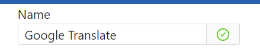

# Bookmark Group Manager
- Creator: [Gordon](https://github.com/gordon0813),  [Jonathan](https://github.com/b06505015),  [Catherine](https://github.com/chien-ying)


## Introduction
1. A web service allowing 50+ users to co-edit bookmarks groups in real-time.
2. Invite people to co-edit bookmarks groups and subscribe others' bookmarks groups.
3. Integrate a popup Google Chrome extension to allow users to comment and rate websites.

## Link
- [Demo video](https://www.youtube.com/watch?v=dW6dqEEwGrc)
- Deployed website: [bookmark group manager](https://bookmark-group-manager.vercel.app/) (google chrome browser recommend)
- Google Chrome Extension [file](https://drive.google.com/file/d/1NfP-yyNE3fN4kwkxGj5BdZ5tB7RV5ULA/view?usp=sharing)
- [Extension file upload tutorial](https://www.youtube.com/watch?v=K0gTg4F6x6k)

## How to install and test in localhost

### Backend
1. Install related files by the following command:
``` bash
cd backend && yarn install
```
2. Set the MongoDB url in `backend/.env`
  ``` bash
  cd backend
  cp .env.defaults .env
  # fill in the MONGO url
  ```
3. The server (port 5000) can be started by the command.
``` bash
cd backend && yarn start
```

### Frontend
1. Install related files by the following command:
``` bash
cd frontend && yarn install
```
2. The client (port 3000) can be started by the command.
``` bash
cd frontend && yarn start
```
3. When the server (port: 5000) is connected, the following test account are able to log in the service
- username: `gordon` password: `0000`
- username: `Catherine` password: `0000`
- username: `Jonathan` password: `123456`


### Google Chrome Extension
> :warning:  Chrome api does `not support in localhost`, we are applying for Chrome extension market, but it might take few weeks to audit, so please `build the project and upload to extension`, thank you~

1. Install related files by the following command:
``` bash
cd extension && yarn install
```
2. Build the project
``` bash
yarn run build
```
3. Open chrome extension page \

Make sure to **turn on the developer mode**, then upload the **`build`** file by unpackage \

4. There might be an error after you open the extension due to Content Security Policy, please click the error button and copy the sha hash. \


5. Open `manifest.json` in `build` folder, and replace  `'sha256-QwxlXLoC5w6m/a9CSpPPLWNmP5D6qbbWh8h/8abQSJM='` with the hash copied in previous step.
``` json
{
  "content_security_policy": "script-src 'self' 'sha256-QwxlXLoC5w6m/a9CSpPPLWNmP5D6qbbWh8h/8abQSJM='; object-src 'self'",  
}
```

6. Reupload the **`build`** file and you could open extension \


---

## Functions
- Test case
  - Search
  - Invite others to a group
  - Accept Invitation
  - Leave a group
  - Subscribe a group
  - Unsunscribe a group
  - Remove a bookmark
  - Login and Register
  - Add new group
  - Add / Remove a bookmark
  - Make a comment on a website
  - Reply to other's comment
  - Give a rate to a website
  - Link from extension to personal page 
- Test Account
  - username: `gordon` password: `0000`
  - username: `Catherine` password: `0000`
  - username: `Jonathan` password: `123456`

### Search
1. Login as any user -> it will show all the group
2. Click on `Grid View` button -> it will show the data as grid view
3. Click on `List View` -> it will show the data as list view
4. Click on one of the group in the side bar to see the certain group -> it will show only one group
5. Click on `All Groups` in the sider bar -> it will show all the groups
6. Click on Search bar in the header -> it will open the drop down renderer
7. Start typing any character -> it does autocomplete
8. use the up/down arrow key to select item in the drop down renderer, and then press enter (or you can click on the link icon) -> it will direct to the search results.
9. Click on your username in the header -> it will show all of the users' groups
10. Click on the `Group Filter` -> it will open the drop down renderer
11. Select some groups in the drop down renderer -> it will show the selected groups
12. Click on the `x` button of the blue cell in the group filter -> the remove item will not be shown
13. Click on `x` button of the group filter -> it will clear all the items in the group filter
14. Click on any bookmark title -> it will open the coresponding website.

### Invite others to join a bookmark group
1. Open two browsers, and login as different users.
2. In userA browser, click on **people plus icon** next to the group name.
3. Select userB and click invite.
4. The message, `Invitation send!`, will show.

### Accept Invitation
- This case follows on from the previous test case
1. In userB browser, it will show the "New Group Invitation!" notification in the upper right corner of the window.
2. In userB browser, click `Accept` button in the message box.
3. The message, `You join the group!`, will show. (Or `You have already joined the group!`, if you have already joined before)
3. Then, in userB browser, you will see the newly added group display at the bottom of the page.

### Leave a group
- This case follows on from the previous test case
1. In userB browser, click on **cross icon** next to the group name
2. It will show an alert.
3. Click on Yes.
4. The message, `You will stop tracking <group name>`, will show.

### Subscribe a group
1. Login as any user.
2. Search any other group or user
3. Click on **hollow bell icon** 
4. The message, `You subscribe <group name>`, will show.
5. Then, It will redirect to the login-user personal page, and the group you just subscribe will be show at the bottom part of the page.

### Unsunscribe a group
- This case follows on from the previous test case
1. Click on **filled bell icon** 
2. It will show an alert.
3. Click on Yes.
4. The message, `You will stop tracking <group name>`, will show.
5. Then, It will redirect to the login-user personal page, and the group you just unsubscribe will not be shown.

### Remove a bookmark
1. Login as any user
2. Click on **delete icon** , either in list view or grid view.
3. It will show an alert.
4. Click on Yes.
5. If you are the owner or the editor of the group, the message `You delete the bookmark!` will show. Otherwise, the message `Oops, you are not an editor of the group. You don't have the access to delete the bookmark.` will show.
6. If delete successly, the deleted bookmark will not be shown.
---

> :warning: **The following functions is combined with Google Chrome Extension. However, Google API service does not support in localhost. To test the following functions, please make sure the Extension tool is build and installed on Chrome browser.**

### Login and Register
1. Click the login button to login page (If you do the action need login first, the login modal will pop out, too.
2. We have already provided some test accounts
  - username: `gordon` password: `0000`
  - username: `Catherine` password: `0000`
  - username: `Jonathan` password: `123456`
3. But if you'd like to register a new account, it's wellcome. (It will check the account and password in both login and register.) \

4. you should see your user name next to the log out button after login successully.
5. Once your login succes, It will remember your account on all the site until you log out.

### Add new group
1. Open our extension and click the `New Group...` option in folder select .
2. Enter your group, set your privacy and click the create button, than you can see your new group has been selected.

### Add / Remove a bookmark
1. Open our extension, select the group and free to add tag to help you mannaging bookmarks.
2. Click the create or remove button to deal with the bookmark.
3. You can see the check sign next to the bookmark's name bar. Green mean it's already in `this group`, otherwise it will be gray. \


### Make a comment on a website
1. Leave the comment of the site and share with other people! \


### Reply to other's comment
- This case follows on from the previous test case
1. Click `Reply to` to leave your thought about others comment.
2. Free to view or hide others replies. \


### Give a rate to a website
1. The star show the average rank get by all the users.
2. You can add or update your rank, and it will show the average rank that contain yours. \


### Link from Google Chrome Extension to personal page
1. There are two place that can link to your own manage page.
  - header \
  
  - more button \
  
2. If you didn't login, it will redirect you to login page in manage system.
---

## Contribution
- b06505004 莊博翰: backend
- b06505032 楊千瑩: frontend
- b06505015 秦逸翔: google chrome extension


